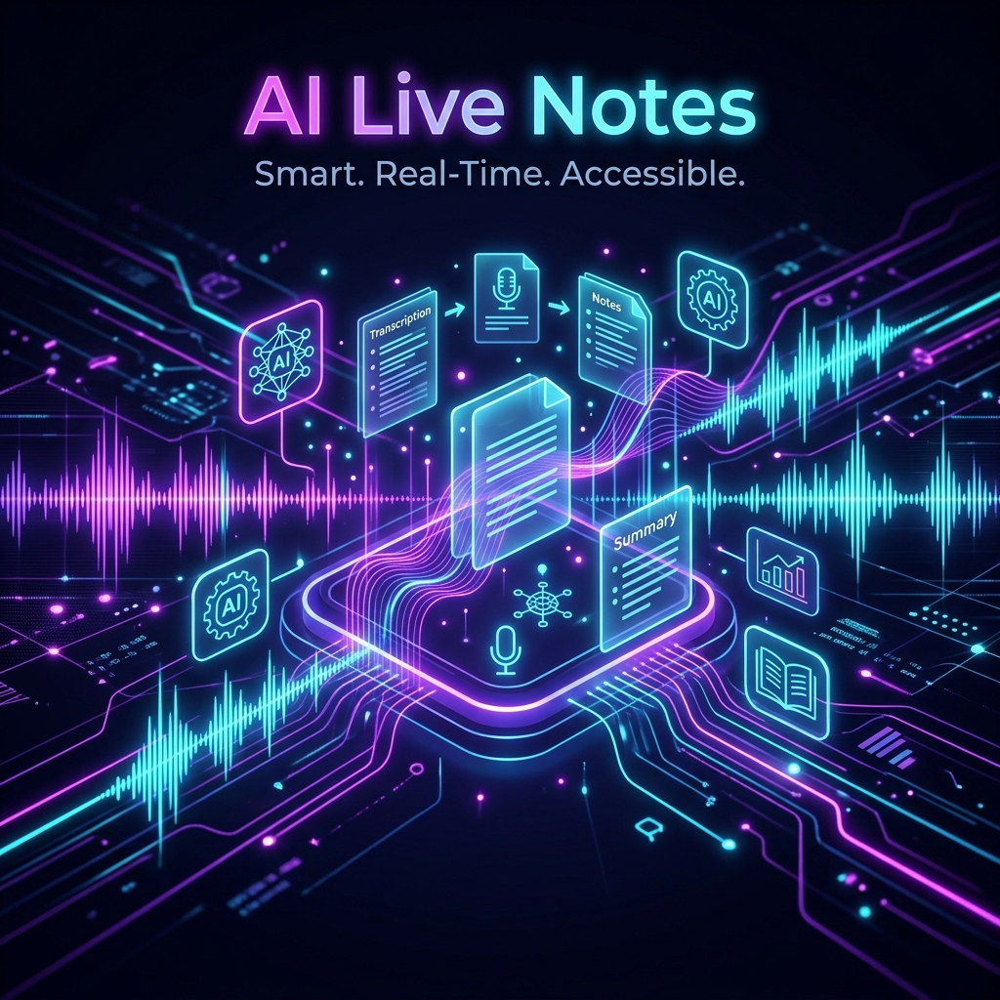

<div align="center">
  

# 🎙️ AI Live Notes 📝

**Transform your live lectures into beautifully structured Markdown notes, instantly.**

[](https://reactjs.org/)
[](https://nodejs.org/)
[](https://expressjs.com/)
[](https://tailwindcss.com/)
[](https://groq.com/)

</div>

---

AI Live Notes is an advanced application that captures live audio and (optionally) screenshots during a lecture, processes them, and transforms them into beautifully formatted Markdown notes. Powered by Groq's blazing-fast inference API, it ensures you never miss a beat.

---

## ✨ Features

- 🎙️ **Live Audio Transcription**: Uses the `whisper-large-v3` model via Groq API to accurately transcribe spoken audio.
- 👁️ **Vision Integration (Optional)**: Automatically incorporates screenshots taken during the lecture to provide context to the generated notes.
- 🧠 **Smart Chunking**: Automatically chunks very long transcripts (~6000 characters per chunk) to reliably circumvent rate limits and token limitations without losing context.
- 🎛️ **Customizable Detail Levels**: Instruct the AI to generate either "highly detailed", "brief", or "Q&A format" notes.
- 📊 **Dashboard & Statistics**: A dedicated dashboard providing an overview of your total sessions, hours recorded, average notes length, and recent history.
- 🔍 **Advanced Search & History**: Easily search through past notes by keyword, or browse them chronologically using the Timeline History modal.
- 📁 **Session Management**: Auto-saves transcripts and notes locally. You can easily retrieve, review, or delete old sessions via the 'My Notes' or 'Dashboard' views.
- 📄 **Infinite PDF Export**: A robust PDF export engine built on the native browser print API, guaranteeing infinite page length with selectable, searchable text (no blurry canvas images!).
- 🎨 **Beautiful & Dynamic UI**: A meticulously crafted interface featuring a calming cream and dark panel aesthetic, smooth transitions, Mermaid diagram rendering, and LaTeX math formatting.
- 🛡️ **Auto-Retry & Rate Limit Handling**: Implements a robust `generateWithRetry` strategy to gracefully handle 429 Too Many Requests errors.
- 🌍 **Multilingual Support**: Automatically translates Hindi/Hinglish content into formal, academic English.
- 💾 **Session Backups**: Real-time caching of ongoing transcripts into a local `backups/` directory to prevent data loss.

---

## 👁️ How Vision Works

When screenshots are captured alongside the audio transcript, the backend intelligently switches from the standard text model (`llama-3.1-8b-instant`) to a powerful vision model (`meta-llama/llama-4-scout-17b-16e-instruct`).

To prevent token explosion while maintaining visual context, the system limits the number of recent unique screenshots sent to the model (taking the last 2). The vision model "sees" the content of these slides and references them seamlessly in the notes!

---

## 🔄 Backup & Recovery System

Lectures can be long, and network connections volatile. That's why AI Live Notes contains a robust backup system:

1. **Continuous Backup**: As audio is transcribed on the fly, the raw transcript is appended locally to `backups/backup_transcript_session_<session_id>.txt`.
2. **Recovery Tool**: If the app crashes, use the built-in recovery script:
   - Run `node recover.js` in the backend.
   - It discovers all session fragments, stitches them in chronological order, and exports a complete `recovered_transcript.txt` that can be re-run!

---

## 🚀 How to Use

### 📋 Prerequisites

- **Node.js** (v18+ recommended)
- A **Groq API Key**

### ⚙️ Backend Setup

1. Navigate to the backend folder:
   ```bash
   cd lecture-notes-backend
   ```
2. Install dependencies:
   ```bash
   npm install
   ```
3. Create a `.env` file in the root of the backend folder:
   ```env
   GROQ_API_KEY=your_api_key_here
   PORT=3000
   ```
4. Start the backend development server:
   ```bash
   npm run dev
   ```
   > **Note:** Directories like `uploads/` and `backups/` are automatically created on startup.

### 🎨 Frontend Setup

1. Navigate to the frontend folder:
   ```bash
   cd lecture-notes-ui
   ```
2. Install dependencies:
   ```bash
   npm install
   ```
3. Start the Vite development server:
   ```bash
   npm run dev
   ```

### 🏁 Running the App

- Open your browser to the local URL provided by Vite (typically `http://localhost:5173`).
- Allow microphone permissions.
- Start a session and the app will capture audio. (Enable screen sharing for Vision features).
- End the recording to trigger the final comprehensive notes generation!

---

<div align="center">
  <i>Built with ❤️ using React, Express, and Groq</i>
</div>
